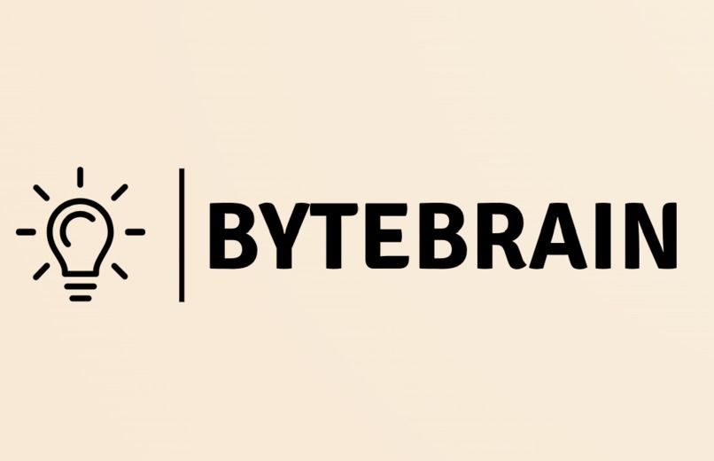

## 👨‍💻 About Me
- I'm a software developer focused on building web applications.
- I enjoy solving complex problems and learning new technologies.

## 🚀 Featured Projects
### [ByteBrain](https://github.com/Toluwaleke765/ByteBrain)

- **Description:** Gamifying math and science.
- **Tech Stack:** Java, Andriod Studios.
- **Features:** Generates unique questions each time.

## 📊 GitHub Stats

## 🛠️ Tech Stack

## 📫 Connect with Me

